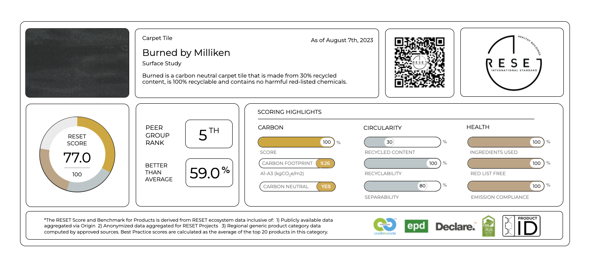
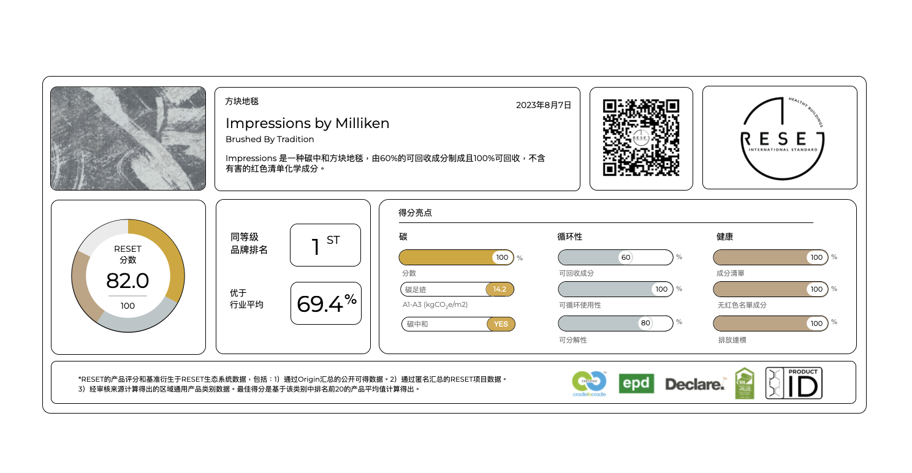

# RESET Embodied Project
## Project Overview
The RESET Embodied Project by GIGA.Reset aims to track the carbon footprint of a given product across three aspects: carbon, circularity, and health. GIGA assigns ratings to clients' products, projects, or offices based on different metrics in each category, summarizing these ratings in individual scorecards for each product. Previously, creating these scorecards involved manually inputting data into slides—an inefficient process given the consistent format of the scorecards.

This repository automates the scorecard generation process, streamlining data insertion and presentation.

## Project Pipeline
1. Data Processing
The data_processing.ipynb script transforms raw data into a structured format, with each row representing a single product and its scores across various metrics.
2. Automated Scorecard Creation
Using python-pptx and a pre-designed PowerPoint template, we automatically populate placeholders and generate relevant graphs for each product.
Run make_slide.ipynb to automatically generate one slide per product, each containing its metrics and ratings.

## Usage
Prepare the Data:

Format the raw data file so each row corresponds to a product with columns for each metric.
Place the formatted data file into the appropriate directory.
Run Data Processing:

Execute data_processing.ipynb to prepare the data for slide generation.
Generate Slides:

Open make_slide.ipynb and run the script.
Each product will be automatically added to a new slide in the template, with ratings populated in placeholders and metrics visualized in graphs.

Example Output: 

For more information on RESET Embodied project, check https://reset.build/standard/embodied

